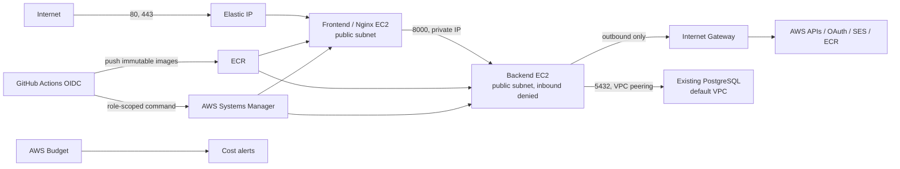

# Eclipcity infrastructure

Цей каталог містить Terraform-код для AWS-інфраструктури Eclipcity. Наразі
реалізовано тільки `dev`; `prod` навмисно залишено окремим root module, щоб state,
змінні й життєвий цикл середовищ ніколи не змішувалися.

## Архітектура dev



- Окремий VPC `10.20.0.0/16` і public/private subnet-и у двох Availability Zones.
- Frontend/edge має стабільний Elastic IP. Лише `80/tcp` і `443/tcp` відкриті з
  Internet; порт 80 потрібен також для HTTP-01 Certbot і HTTPS redirect.
- Backend має ephemeral public IPv4 для дешевого outbound Internet access, але
  security group не має жодного public ingress. Порт `8000/tcp` доступний лише
  від frontend security group, а frontend використовує private backend IP.
- `22/tcp` не відкривається. Адміністративний доступ виконується через SSM Session
  Manager.
- NAT Gateway за замовчуванням вимкнений. Backend виходить до AWS API, Google,
  SMTP/SES та registry через Internet Gateway; inbound Internet traffic лишається
  заблокованим. Трафік до БД іде більш специфічним private peering route.
- Приватний VPC peering з default VPC; двосторонні routes і правило PostgreSQL
  дозволяють `5432/tcp` лише від backend security group.
- Private Route 53 hostname
  `postgres.internal.dev.eclipcity.digitee.space` приховує нестабільні EC2 IP від
  конфігурації застосунку.
- Private Route 53 hostname
  `backend.internal.dev.eclipcity.digitee.space` стабільно направляє nginx на
  backend private IP.
- GitHub Actions отримує короткоживучі AWS credentials через OIDC, збирає ARM64
  images у ECR та запускає окремі backend/frontend SSM deployments без SSH.
- Обидва application EC2 за замовчуванням `t4g.micro`. Root EBS volumes — `gp3`,
  зашифровані безплатним AWS-managed `alias/aws/ebs`; EC2 вимагають IMDSv2.
- Увімкнені VPC Flow Logs з retention 30 днів.
- Опційний account-level AWS Budget надсилає email при 50%/80% actual і 100%
  forecasted від місячного ліміту; за замовчуванням ліміт `$25`.
- SES identity для `dev.eclipcity.digitee.space` створюється Terraform, а A/SES
  записи синхронізуються окремим idempotent-скриптом через `adm.tools` API.

Ці два EC2 розділяють ролі й зменшують blast radius, але **не є повною high
availability**: кожна роль поки має один instance.
VPC уже розкладено на два AZ. Справжня HA потребуватиме ALB і щонайменше двох
instances/targets для кожного критичного tier; це доцільніше зробити для `prod` або
коли dev має витримувати відмову цілого AZ.

## Структура

```text
infrastructure-tf/
├── bootstrap/        # одноразове створення S3 remote state
├── dev/              # dev root module та environment-specific modules
│   ├── dns/          # зовнішній DNS manifest і перевірка
│   ├── budget/       # account-level monthly cost budget і email alerts
│   ├── cicd/         # ECR, GitHub OIDC roles, SSM deployment documents
│   ├── ec2/          # frontend/backend instances та Elastic IP
│   ├── iam/          # SSM, ECR read-only, least-privilege secret access
│   ├── network/      # security groups, DB peering і routes
│   ├── ses/          # SES identity, DKIM, MAIL FROM
│   ├── s3/           # пояснення щодо application buckets
│   └── vpc/          # VPC, subnets, routes, optional NAT, flow logs
├── modules/          # майбутні shared modules після стабілізації dev/prod
└── prod/             # окреме prod-середовище, ще не реалізоване
```

Неймінг: `eclipcity-dev-<role|resource>`. На ресурсах, які підтримують tags,
встановлюються `Project`, `Environment`, `ManagedBy`, `Owner`, `CostCenter`,
`Repository`, а також `Name` і, де доречно, `Role`/`Tier`.

## Передумови

- Terraform `>= 1.10`;
- AWS CLI v2;
- AWS account із дозволами на S3, VPC, EC2, IAM, Budgets, CloudWatch Logs, SSM,
  Secrets Manager metadata та SES;
- `jq` і `dig` для DNS helper scripts;
- наявні dev backend і `adm.tools` API secrets у `eu-central-1`.

## 1. Авторизація й remote state

```bash
aws login
aws sts get-caller-identity
AWS_REGION=eu-central-1 ./infrastructure-tf/bootstrap/bootstrap-state.sh
```

Скрипт ідемпотентно створить account-specific S3 bucket, увімкне versioning,
server-side encryption, повне блокування public access, policy з вимогою TLS і
native S3 lock file. Локальний `dev/backend.hcl` буде створено автоматично й він
ігнорується Git.

```bash
terraform -chdir=infrastructure-tf/dev init -backend-config=backend.hcl
```

## 2. Secret і змінні

Знайти ARN, не читаючи secret value:

```bash
aws secretsmanager list-secrets \
  --region eu-central-1 \
  --query 'SecretList[].{Name:Name,ARN:ARN}' \
  --output table
```

Створити локальний файл змінних:

```bash
cp infrastructure-tf/dev/terraform.tfvars.example infrastructure-tf/dev/terraform.tfvars
```

`backend_secret_arn` уже має environment-specific default. Secret contents ніколи
не треба додавати в `.tf`, `.tfvars`, user data або Terraform state. Backend role отримує
`secretsmanager:GetSecretValue` тільки для цього ARN. Якщо secret зашифрований
customer-managed KMS key, треба також встановити `backend_secret_kms_key_arn`.

Для email cost alerts встановити локально:

```bash
export TF_VAR_budget_alert_email="you@example.com"
```

Email зберігатиметься у remote Terraform state як subscriber metadata, тому state
bucket має лишатися приватним. Параметр обов'язковий: Terraform не дозволить plan
або apply з вигаданою за замовчуванням адресою.

Для dev у secret мають бути, зокрема:

```text
FRONTEND_BASE_URL=https://dev.eclipcity.digitee.space
BACKEND_PUBLIC_URL=https://dev.eclipcity.digitee.space/api
GOOGLE_REDIRECT_URI=https://dev.eclipcity.digitee.space/api/auth/google/callback
SMTP_FROM_EMAIL=no-reply@dev.eclipcity.digitee.space
POSTGRES_HOST=postgres.internal.dev.eclipcity.digitee.space
```

У Google OAuth client цей самий `GOOGLE_REDIRECT_URI` має бути доданий до
Authorized redirect URIs. Локальний callback
`http://localhost/api/auth/google/callback` слід залишити окремим дозволеним URI.

## 3. Перевірка й застосування

```bash
terraform -chdir=infrastructure-tf/dev fmt -recursive -check
terraform -chdir=infrastructure-tf/dev validate
terraform -chdir=infrastructure-tf/dev test
terraform -chdir=infrastructure-tf/dev plan -out=dev.tfplan
terraform -chdir=infrastructure-tf/dev show dev.tfplan
terraform -chdir=infrastructure-tf/dev apply dev.tfplan
```

Застосовувати треба лише збережений і переглянутий plan. `dev.tfplan` і локальні
`.tfvars` ігноруються Git. Перший apply після переходу на cost-optimized dev:

- видалить NAT Gateway та його Elastic IP;
- замінить обидва application EC2 через зміну instance type/EBS key, а backend
  також через перехід у public subnet;
- переведе root volumes на `alias/aws/ebs`;
- поставить попередній customer-managed KMS key у 30-денний deletion window.

Це означає короткий downtime. До apply треба переглянути plan і переконатися, що
на локальних root volumes EC2 немає незбережених application data.

## 4. DNS через adm.tools API

`digitee.space` — уже наявна DNS zone (`domain_id=1579290`).
`dev.eclipcity.digitee.space` не є окремою реєстрацією домену: це запис
`dev.eclipcity` у цій zone. Після створення frontend Elastic IP Terraform формує
точний A/SES manifest:

```bash
./infrastructure-tf/dev/dns/export-records.sh
```

Перевірити різницю з API без змін:

```bash
./infrastructure-tf/dev/dns/sync-records.sh plan
```

Після review створити відсутні й оновити змінені записи:

```bash
./infrastructure-tf/dev/dns/sync-records.sh apply
```

Скрипт отримує token із
`arn:aws:secretsmanager:eu-central-1:396287094980:secret:eclipcity/dev/dns-PfFhVn`
і очікує JSON key `adm_api`. Token не друкується й не потрапляє у Terraform state.
Скрипт:

- працює лише всередині `dev.eclipcity.digitee.space`;
- звіряє zone та `domain_id` перед змінами;
- не видаляє записи;
- зупиняється на duplicates або CNAME conflicts;
- вимагає явний режим `apply` для mutation.

Буде синхронізовано:

- `A` для `dev.eclipcity.digitee.space` → frontend Elastic IP;
- SES verification `TXT`;
- три DKIM `CNAME`;
- MAIL FROM `MX` і SPF `TXT`.

Перевірити application record:

```bash
./infrastructure-tf/dev/dns/check-dns.sh
```

Certbot запускати лише після успішної DNS-перевірки. Сертифікат і private key не
мають потрапляти до Git або Terraform state.

SES identity і DNS verification не створюють SMTP credentials і не переводять
AWS account із SES sandbox у production access. SMTP credentials мають уже бути в
Secrets Manager, а для листів довільним одержувачам потрібен окремий approved SES
production-access request у цьому ж регіоні.

## 5. Приватне підключення до наявної PostgreSQL

Terraform **не створює, не перезапускає і не змінює дані БД**. Він додає лише:

- peering між dev VPC і `vpc-0b4438217b4166a48`;
- route до `172.31.0.0/16` у dev public route table, де працює backend;
- зворотний route до `10.20.0.0/16` у `rtb-0bd8444443bb801b4`;
- ingress `5432/tcp` у `sg-09b030b01fdfd4f39` лише від backend SG;
- private Route 53 A record на поточний private IP DB instance
  `i-02bf5a28818374a1c`.

Після apply перевірити hostname:

```bash
terraform -chdir=infrastructure-tf/dev output -raw database_private_hostname
```

Безпечно перевірити зміну тільки `POSTGRES_HOST`, не друкуючи secret value:

```bash
./infrastructure-tf/dev/network/sync-database-secret.sh plan
```

Після review створити нову версію secret, у якій змінено лише цей ключ:

```bash
./infrastructure-tf/dev/network/sync-database-secret.sh apply
```

Решта credentials лишаються без змін. До оновлення secret backend не зможе
використати приватний маршрут.

## 6. Доступ до EC2

```bash
terraform -chdir=infrastructure-tf/dev output -raw frontend_ssm_command
terraform -chdir=infrastructure-tf/dev output -raw backend_ssm_command
```

Виконайте виведену команду. SSH key pairs і inbound port 22 не потрібні.

## 7. Автоматична доставка dev

Перший Terraform apply створює ECR repositories, GitHub OIDC provider, окремі
build/backend/frontend roles, SSM documents і pointers на instance IDs. Після
цього push application changes у `main` автоматично:

1. виконує frontend/backend tests;
2. збирає ARM64 images і публікує immutable digest-и в ECR;
3. запускає migration та backend deployment на backend EC2;
4. лише після healthy backend оновлює frontend/nginx на frontend EC2;
5. запускає public smoke checks.

У GitHub потрібен Environment `dev` без required reviewers і з дозволом deploy
лише з `main`. AWS keys у GitHub Secrets не потрібні. Повний runbook і rollback
policy: `cicd/README.md`.

## Вартість і наступні кроки

Основні постійні витрати dev після оптимізації: три EC2 разом із наявною БД,
public IPv4, EBS, Route 53 private zone, Secrets Manager і CloudWatch Logs. NAT
Gateway і customer-managed EBS KMS key більше не потрібні. Budget за замовчуванням
контролює account-wide витрати, оскільки tag-based cost allocation може з'являтися
із затримкою.

До наступного етапу залишено Certbot bootstrap/renewal, alarms/backups та повна
HA-схема для prod.
